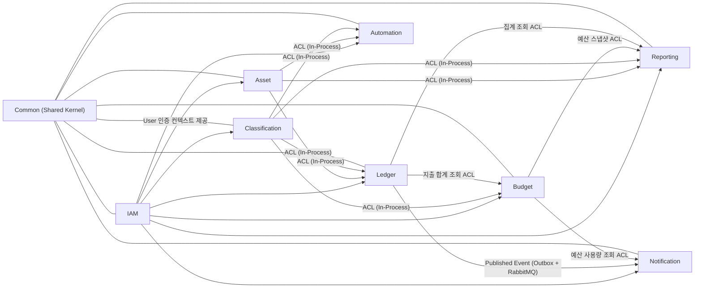

# PAYV 프로젝트 아키텍처 분석 (구현 기준)

본 문서는 `/Users/uitak/workspace/intellij/payv`의 **현재 구현 코드**를 기준으로 Bounded Context 설계, 전술적 설계, 이벤트/정합성 흐름, 인프라 구현 방식을 정리한 분석 문서입니다.

## A) Bounded Context 설계 및 분리 전략

### 1) 분리 이유 (Strategic Design)

| Bounded Context | 해결하려는 비즈니스 문제 | 경계 설정 근거 |
|---|---|---|
| IAM | 사용자 가입/인증/인가/세션 식별 | 보안 정책(암호화, 인증 흐름)이 다른 도메인과 독립적으로 진화해야 함 |
| Asset | 결제/보유 수단(현금/카드/계좌) 관리 | 거래/리포트/고정비에서 참조되는 공통 마스터이지만 생명주기는 독립 |
| Classification | 카테고리(1/2-depth), 태그 분류 체계 관리 | 분류 체계 정책(개수, 계층, 이름 규칙)이 거래 입력과 분리되어야 함 |
| Ledger | 거래(Transaction), 이체(Transfer), 첨부파일 관리 | 가계부의 원장(쓰기 중심)이며 금액/일자/출처 정합성 책임 |
| Budget | 월별 전체/카테고리 예산과 소진율 계산 | 예산 정책(중복 금지, 월 단위, 롤업 계산)을 독립적으로 관리 |
| Automation | 고정비 마스터/실행 인스턴스/배치 자동화 | 스케줄링/재시도/중복 방지 등 일괄 처리 관심사 분리 |
| Reporting | 월별 리포트/홈 대시보드 조회 모델 | 다수 BC 데이터를 읽기 모델로 재구성하는 조회 전용 컨텍스트 |
| Notification | 인앱 알림 정책/보관/읽음 처리 | 이벤트 기반 정책(예산 임계치, 고정비 자동생성)을 독립 처리 |
| Common (Shared Kernel) | 페이징, 에러 응답, 공통 이벤트, 캐시 키/이름 | BC 간 공통 기술 요소의 중복 제거 및 표준화 |

### 2) 컨텍스트 맵 (Context Map)

#### 협력 패턴 요약
- **Customer/Supplier + ACL(In-Process)**: 대부분 BC 간 동기 호출은 `application.port` + `infrastructure.adapter`로 연결.
- **Published Language**: 비동기 이벤트 계약은 `LedgerTransactionChangedEvent`를 공용 언어로 사용.
- **Shared Kernel**: `modules/common`이 공통 예외/응답/페이징/캐시 키/이벤트 타입 제공.

## B) 전술적 설계 요소 (Tactical Design)

### 1) Aggregate Root

- IAM: `User`
- Asset: `Asset`
- Classification: `Category`(루트+자식 관리), `Tag`
- Ledger: `Transaction`, `Transfer`
- Budget: `Budget`
- Automation: `FixedExpenseDefinition`, `FixedExpenseExecution`
- Notification: `Notification`, `NotificationDispatchLog`
- Reporting: 영속 AR보다는 읽기 도메인 모델 `MonthlyReport` 중심

### 2) Entities

- 식별자 기반 상태 변경 객체:
- `User`, `Asset`, `Category`, `Tag`, `Transaction`, `Attachment`, `Transfer`, `Budget`, `FixedExpenseDefinition`, `FixedExpenseExecution`, `Notification`, `NotificationDispatchLog`

### 3) Value Objects

- 식별자 VO: `UserId`, `AssetId`, `CategoryId`, `TagId`, `TransactionId`, `AttachmentId`, `TransferId`, `BudgetId`, `FixedExpenseDefinitionId`, `FixedExpenseExecutionId`, `NotificationId`
- 금액 VO: `Money` (`Ledger`에서 사용)
- 열거형/정책형 VO 성격:
- `AssetType`, `TransactionType`, `TransactionSourceType`, `NotificationType`, `FixedExpenseCycle`, `FixedExpenseExecutionStatus`

### 4) Domain Services

현재 코드베이스는 **명시적 Domain Service 클래스가 거의 없고**, 다음 방식으로 비즈니스 로직을 배치함:

- 엔티티/AR 내부 정책:
- 예: `Category`(계층/이름/활성 정책), `Transaction`(태그/첨부 개수 제한), `FixedExpenseDefinition`(스케줄 판단)
- 애플리케이션 서비스 오케스트레이션:
- 예: `TransactionCommandService`, `BudgetCommandService`, `FixedExpenseCommandService`, `NotificationPolicyHandler`

즉, 전술적으로는 **AR에 핵심 규칙 + Application Service에 BC 간 조합 로직** 구조를 채택.

## C) 주요 기능 및 도메인 이벤트 흐름

### 1) 핵심 기능 (유스케이스 관점)

- 거래 기록/수정/삭제 + 태그/카테고리/첨부파일 관리
- 이체 기록/수정/삭제
- 카테고리/태그/자산 마스터 관리
- 월별 예산(전체/카테고리별) 설정 및 소진율 조회
- 고정비 마스터 등록 및 배치 기반 자동 거래 생성
- 월별 리포트/홈 대시보드 조회
- 인앱 알림(예산 50%/100%, 고정비 자동 생성) 발송 및 읽음 처리

### 2) 도메인 이벤트 명세

#### 이벤트: `LedgerTransactionChangedEvent`
- 발행 BC: `Ledger`
- 발행 시점: `TransactionCommandService`의 생성/수정/삭제 트랜잭션 내 Outbox 적재
- 전달 방식: Outbox Relay 스케줄러 -> RabbitMQ -> Notification Consumer
- 핵심 페이로드:
- `ownerUserId`, `changeType(CREATED/UPDATED/DELETED)`, `before/after snapshot`, `occurredAt`
- 파생 판단:
- `affectedExpenseMonths()`: 예산 관련 월 영향 범위 계산
- `isFixedExpenseAutoCreated()`: 고정비 자동 생성 거래 여부 판단

### 3) 이벤트 기반 상호작용 흐름

#### 흐름 A: 지출 발생 -> 예산 임계치 알림
1. Ledger에서 거래 변경 발생.
2. Outbox에 이벤트 저장(트랜잭션 원자성).
3. Relay가 RabbitMQ로 publish (confirm/return 확인).
4. Notification Consumer가 수신 후 manual ack.
5. `NotificationPolicyHandler`가 Budget ACL로 월별 소진 현황 조회.
6. 50%/100% 최초 도달 시 `notification_dispatch_log` 기반 멱등 체크 후 인앱 알림 생성.

#### 흐름 B: 고정비 배치 실행 -> 자동 생성 알림
1. `@Scheduled`로 Spring Batch Job 실행.
2. 실행일 대상 `FixedExpenseDefinition`만 조회.
3. Writer가 중복 실행 여부 확인 후 Ledger에 자동 거래 생성 요청.
4. Ledger가 `sourceType=FIXED_COST_AUTO` 거래 생성 및 이벤트 발행.
5. Notification에서 `isFixedExpenseAutoCreated()` 조건으로 최초 1회 알림 생성.

## D) 인프라 및 구현 기술 (Technical Implementation)

### 1) 모듈 격리 방식

- Maven 멀티모듈:
- `/Users/uitak/workspace/intellij/payv/pom.xml`에서 BC별 모듈을 독립 JAR로 관리, `app-web`가 조립.
- 계층 구조 통일:
- 각 BC가 `presentation/application/domain/infrastructure` 패키지 구조를 일관되게 사용.
- 스프링 컨텍스트 분리:
- Root Context는 application/infrastructure 빈 스캔.
- Servlet Context는 presentation(controller)만 스캔.
- DB 스키마 분리:
- BC별 SQL 스크립트(`scripts/db/*_schema.sql`) 제공.

### 2) 메시징 처리 (RabbitMQ + Outbox)

- Outbox 테이블: `ledger_event_outbox`
- 상태 관리: `PENDING -> RETRY -> PUBLISHED`
- 신뢰성:
- Publisher Confirm + Return 체크(`LedgerEventOutboxRelay`)
- Consumer Manual ACK/NACK(`NotificationRabbitConsumer`)
- 재시도:
- Relay에서 지수 백오프(`retry_base_delay`, `retry_max_delay`)
- 멱등성:
- `notification_dispatch_log`에 `dispatch_key` unique insert (`ON CONFLICT DO NOTHING`)

### 3) 캐싱 전략 (Redis)

- Cache Manager: `RedisCacheManager` (Lettuce, cache별 TTL 분리)
- 캐시 대상:
- `reporting:monthly-summary`
- `reporting:home-dashboard`
- `ledger:recent:first-page` (1페이지 + 자산필터 없음 조건)
- `budget:monthly-status`
- 조회 최적화:
- Query Service의 `@Cacheable` 적용
- 무효화:
- 거래/예산 CUD 시 `@CacheEvict(allEntries = true)`로 관련 캐시 일괄 비움

## 추가 핵심 사항

### 1) 컨텍스트 매핑 핵심 요약

- 동기 통신은 **In-Process ACL Adapter**가 표준 연결점.
- 비동기 통신은 **Ledger -> Notification** 단일 이벤트 채널이 핵심.
- `Common`은 Shared Kernel로 BC 전반에 공통 정책/계약 제공.

### 2) 트랜잭션 경계 및 정합성 전략

- 기본 전략: **로컬 트랜잭션(동기 호출)**  
- 단일 DB/단일 트랜잭션 매니저(`DataSourceTransactionManager`) 위에서 BC 서비스가 동작.
- 비동기 후속 처리: **최종 정합성(Eventual Consistency)**  
- 알림 반영은 메시지 소비 시점에 완료되며, 원장 커밋과 시간적으로 분리됨.
- 읽기 정합성:
- Budget 소진액은 저장값이 아니라 Ledger 집계 조회 기반(조회 시 계산).
- Reporting은 다중 BC 조회 결과를 조합하므로 캐시 TTL/무효화 타이밍의 영향 받음.

### 3) 구현된 도메인 이벤트 트리거

- `Transaction Created/Updated/Deleted` -> `LedgerTransactionChangedEvent`
- 해당 이벤트 기반 파생 처리:
- Budget 임계치 알림(50/100 최초 1회)
- Fixed Expense 자동 생성 알림(거래 생성 성공 시 1회)

---

## 코드 근거 (주요 파일)

- 모듈/빌드: `/Users/uitak/workspace/intellij/payv/pom.xml`
- Root 조립: `/Users/uitak/workspace/intellij/payv/modules/app-web/src/main/resources/spring/root-context.xml`
- MVC/SSR-AJAX 구성: `/Users/uitak/workspace/intellij/payv/modules/app-web/src/main/resources/spring/servlet-context.xml`
- Security 구성: `/Users/uitak/workspace/intellij/payv/modules/app-web/src/main/resources/spring/security-context.xml`
- Rabbit 구성: `/Users/uitak/workspace/intellij/payv/modules/app-web/src/main/resources/spring/rabbit-context.xml`
- Redis 캐시 구성: `/Users/uitak/workspace/intellij/payv/modules/app-web/src/main/java/com/payv/appweb/config/RedisCacheConfig.java`
- 거래 이벤트 발행(Outbox): `/Users/uitak/workspace/intellij/payv/modules/ledger/src/main/java/com/payv/ledger/application/command/TransactionCommandService.java`
- Outbox 릴레이: `/Users/uitak/workspace/intellij/payv/modules/ledger/src/main/java/com/payv/ledger/infrastructure/messaging/LedgerEventOutboxRelay.java`
- 알림 정책 소비: `/Users/uitak/workspace/intellij/payv/modules/notification/src/main/java/com/payv/notification/application/listener/NotificationPolicyHandler.java`
- BC별 스키마: `/Users/uitak/workspace/intellij/payv/scripts/db/`
